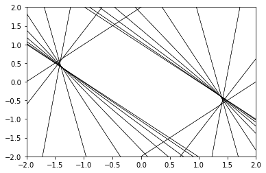

{
  "title": "Convex Optimization",
  "date": "2022-08-26T07:31:53Z",
  "lastmod": "2022-08-26T07:31:53Z"
}


# Convex Optimization

<!--eofm-->


Note:
These notes are not mathematically rigorous. These are meant for quick reference, please read the [Convex Optimization book](https://web.stanford.edu/~boyd/cvxbook/) from Boyd and Vandenberghe for more rigorous treatment.


## Chapter 2: Convex Sets


### Sets


#### Affine Sets


Affine combination: $\\sum\_{i=1}^{i=N} \\theta\_i x\_i$ such that $\\sum\_{i=1}^{i=N} \\theta\_i = 1$.

Draw a line passing through any two points, if the whole line is in the set, the set is affine.

Every affine set C can be written as $C = V + x\_0$ for any $x\_0 \\in C$, where V is a subspace.

Affine Hull of C (**aff** C)
: Smallest affine set, which contains C.

Affine Dimension
: Dimension of an affine hull.

Relative Interior
: **relint** C = {x ∈ C | B(x, r) ∩ aff C ⊆ C for some r > 0}.

Boundary
: **cl** C - **relint** C

##### Example

Let C = $\\{x \\in R^3 | −1 \\le x\_1 \\le 1, −1 \\le x\_2 \\le 1, x\_3 = 0\\}$. That is a square.

- Interior: Empty
- Relative interior: square without the border
- Boundary: the perimeter


#### Convex Sets

Convex combination
: $\\sum\_{i=1}^{i=N} \\theta\_i x\_i$ such that $\\sum\_{i=1}^{i=N} \\theta\_i = 1$ and $\\theta\_i \\ge 0$.

Draw a line segment between any two points, if the whole line segment is in the set, the set is convex.


#### Cones

Cone
: A set C is called a cone, if for every x ∈ C and θ ≥ 0 we have $\\theta x \\in C$

Convex Cone
: A set C is convex cone, if it is convex and a cone!

Conic Combination
:  $\\sum\_{i=1}^{i=N} \\theta\_i x\_i$ such that $\\theta\_i \\ge 0$.


### Some Important Examples

| example                | affine? | convex? | convex cone?  |
| ---------------------- | ------- | ------- | ------------- |
| hyperplane             | Y       | Y       | Y<sup>1</sup> |
| halfspace              | N       | Y       | Y<sup>1</sup> |
| norm ball              | N       | Y       | N             |
| norm cones             | N       | Y       | Y             |
| polyhedra              |         | Y       |               |
| positive definite cone |         | Y       | Y             |

1. Only if 0 is in the set.


Hyperplane
: $\\{x | a^T x = b\\} = \\{x | a^T(x-x\_0) = 0\\}$ for constant vector a and scalar b. Where $x\_0$ is any point in the hyperplane.

Closed Half spaces
: $\\{x | a^T x \\le b\\}$

Euclidean Ball
: $B(x\_c, r) = \\{ x \\, | \\, \\| x - x\_c \\|\_2 \\le r \\} = \\{  x\_c + ru \\, | \\, \\| u \\|\_2 \\le 1\\}$.

Ellipsoid
: $ E = \\{ x \\, | \\, (x - x\_c)^T P^{-1} (x-x\_c) \\le 1 \\} = \\{ x\_c + Au \\, | \\, \\| u \\|\_2 \\le 1 \\}$. Where, P is positive definite matrix, and A is square and non singular matrix.

Norm Cones
: $\\{ (x, t) \\, | \\, \\| x \\| \\le t\\} \\subset R^{n+1}$.

Second order cone (Lorentz cone)
: Norm cone where norm is euclidean norm.

Polyhedron
: A polyhedron is thus the intersection of a finite number of halfspaces and hyperplanes.

Simplex
: Simplex is a special polyhedron. If $v\_0, \\dots, v\_k$ are affinely independent (that is $v\_1-v\_0, \\dots , v\_k-v\_0$ are linearly independent) then simplex is just convex hull of $(v\_0, \\dots, v\_k)$.


### Operations that preseve convexity


#### Intersection

If $S\_\\alpha$ is a convex set for for every $\\alpha \\in \\cal{A}$ where $\\cal{A}$ is any set (could be uncountable infinite), then $\\cap\_{\\alpha \\in \\cal{A}} S\_\\alpha$ is also convex. Converse is also true. Every closed convex set S is a (usually infinite) intersection of halfspaces.


```python
import numpy as np
import matplotlib.pyplot as plt

x = np.linspace(-2, 2, num=100)
ts = np.linspace(-np.pi/3, np.pi/3, num=20)

```


```python
def S(t):
    c1, c2 = np.array([np.cos(t), np.cos(2*t)])
    c, m = 1/c2, c1/c2
    return (lambda x: c - m*x, lambda x: -c - m*x)

```


```python
for t in ts:
    y1, y2 = S(t)
    plt.plot(x, y1(x), 'k', lw='.5');
    plt.plot(x, y2(x), 'k', lw='.5');
plt.ylim(-2, 2);
plt.xlim(-2, 2);

```

```text
<Figure size 432x288 with 1 Axes>

```


#### Affine Functions

Function f is affine if f = Ax + b for some A and b.

If S is convex then the image of S under f (i.e. $f(S) = \\{f(x) | x \\in S\\}$) is also convex. 

If g is a function such that the image of g is S and S is convex, then the inverse image of S (i.e. $\\{x | g(x) \\in S\\}$) is also convex.

Hyperbolic Cone
: $\\{ x | x^T P x \\le (c^T x)^2, c^T x \\ge 0 \\}$


#### Perspective Function

$P: R^{n+1} \\to R^n$, where **dom** P = $R^n \\times R\_{++}$. P is defined as $P(z, t) = z/t$.

If domain of P is convex then the image of P is also convex.


#### Linear Fractional Function

Combination of Perspective and affine.

$$
f(x) = \\frac{Ax+b}{c^T x + d}
$$

where $c^Tx+d > 0$.

If C is convex, then $f(C)$ is also convex. 

If C is convex, then $f^{-1}(C)$ is also convex.


### Generalized Inequalities


Proper Cone
: A cone is proper if it is convex, closed, solid (non empty interior) and is pointed (it does not contain a line).

Generalized inequality with respect to proper cone K
: $ x \\le\_K y \\iff y - x \\in K$. Also $ x <\_K y \\iff y-x \\in \\textbf{int} K$


Examples
1. $ K = R^n\_+ $. Then for vectors x and y,  $x \\le y$ iff $x\_i \\le y\_i$ for all i.
2. $ K = S^n\_+ $. Then for matrices A and B, $A \\le B$ iff $B - A$ is positive semidefinite.


#### Minimum and Minimal

Minimum
: $x \\in S$ is the minimum if for every $y \\in S$ we have $ x \\le y$.

Minimal
: $x \\in S$ is a minimal if $y \\in S, y \\le x$ only if $y = x$.


### Separating Hyperplane

If C and D are disjoint convex set, there exists a and b such that $a^T x \\ge b$ for all x in D and $a^T x \\le b$ for all x in C.

If C is a convex and $x\_0 \\notin C$. Then $x\_0$ and C can be strictly separated.


Converse of above theorem is not true. That is there may exist convex sets C and D which are separated by a hyperplane, they still might intersect. Simple example is $C = D = \\{0\\} \\subset R$. $x = 0$ separates C and D.

Converse holds if C and D are convex and C is open set.

Thus, any two convex sets C and D, at least one of which is open, are disjoint **iff** there exists a separating hyperplane. 


```python


```

