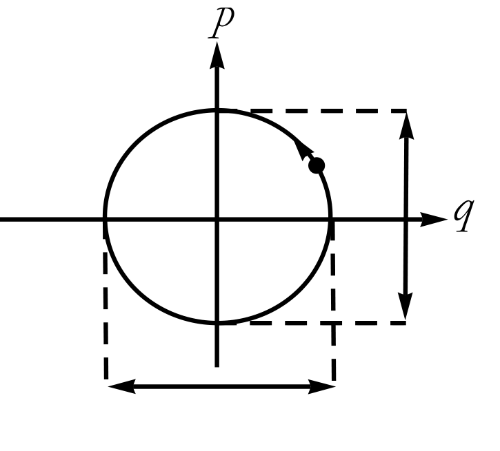
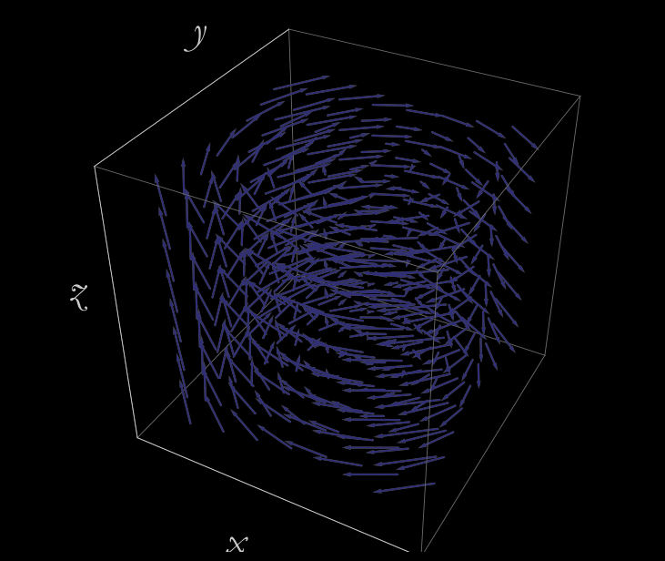

{
  "title": "CM-Notes",
  "date": "2022-09-28T01:08:59Z",
  "lastmod": "2022-09-28T01:08:59Z"
}


## Notation

$ F\_i(\\{q\\}) $ is the force on ith particle. $ \\{q\\} $ is the set of cordinates of all particles.

If there are N particles in the system,

Configration space:  3N dimensional space, records positions.

State space: 6N dimensional space, records position and velocity.

Phase space: 6N dimesnional space, records position and momentum.


## Newton's second law

gives us 6N equations.

$$
\\begin{align*}
\\dot{p}\_i &= F\_i(\\{q\\}) \\\\
\\dot{q}\_i &= \\frac{p\_i}{m\_i}
\\end{align*}
$$

Thus, if forces are known, we can compute trajectory in 6N dimensional configration space.


if we denote $ p = \\sum\_{i=1}^{i=N} p\_i $,

## Newton's third law,

    every force has equal and opposite reaction
    
can be used to derive conservation of momentum.

$\\dot{p} = 0$.

What this tells us is if we start our trajectory at some 6N-D point in configration space, all the points in the trajectory have the same momentum. In some sense, system evolves on a contour of constant momentum.


## Energy

Potential Energy Principle: All forces derive from a potential energy function $V(\\{q\\})$.


For particle moving in 1 dimension, 

$ F(q) = -\\frac{dV(q)}{dq}$.

Potential energy can be computed as $V(q) = - \\int\_{-\\infty}^q F(q') dq'$.

Potential energy is not conserved. Sum of potential energy and kinetic energy are conserved.

Kinetic energy: $T = \\frac{1}{2} mv^2$.


More than one particles, three dimensions. If the system has N particles, the i in $q\_i$ can index any of the 3N elements of the configration space.

Principle:
For **any** system there exists a potential function $V(\\{q\\})$, such that,

$$
F\_i(\\{q\\}) = - \\frac{\\partial V(\\{q\\})}{\\partial q\_i}
$$

In general mathematics such function need not exist for a collection of $F\_i$s. This law represents conservation of energy.


## Lagrangian

### For one particle in one dimension
We are given $q(t\_0)$ and $q(t\_1)$.

$L(q, \\dot{q}) = T - V = \\frac{1}{2}m\\dot{q}^2 - V(\\{q\\})$

Action $A = \\int\_{t\_0}^{t\_1} L  dt$.

Principle of least action tells that the particle chooses a trajectory (the function q) which minimizes the the action.

Principle of least action gives Euler-Lagrange equations.

$$
\\frac{d}{dt} \\frac{\\partial L}{\\partial \\dot{q}} - \\frac{\\partial L}{\\partial {q}} = 0
$$

### For multidimensional motion of many particles
Euler-Lagrange equations are given by,

$L(\\{q\\}, \\{\\dot{q}\\}) = \\sum\_i \\frac{1}{2}m\_i\\dot{q}\_i^2 - V(\\{q\\})$.

$$
\\frac{d}{dt} \\frac{\\partial L}{\\partial \\dot{q}\_i} - \\frac{\\partial L}{\\partial {q\_i}} = 0
$$

Lagrangian packs all the equations of the motions concisely.

$\\frac{\\partial L}{\\partial \\dot{q}\_i}$ is called generalized momentum conjugate to $q\_i$. This can be motiviated by thinking of $q\_i$ as cartesian coordinates and $L = \\frac{1}{2}m\\dot{x}^2$. Depending upon the Lagrangian, conjugate momentum may not have familiar form, but it is always difined by the formula $p\_i =\\frac{\\partial L}{\\partial \\dot{q}\_i}$.

So, if the Lagrangian does not depend on $q\_i$, $\\dot{p}\_i = 0$, i.e. the conjugate momentum is conserved. Such coordinates are called cyclic coordinates.

#### Another example of cylic coordinates

$ L = \\frac{m}{2}(\\dot{x}\_1^2 + \\dot{x}\_2^2 ) + V(x\_1 - x\_2)$. It does look like that L is a function of $x\_1$ and $x\_2$, so neither of these is cyclic coordinate. But, if we do change of variables,
$$
\\begin{align*}
x\_+ &=  \\frac{x\_1+x\_2}{2} \\\\
x\_- &=  \\frac{x\_1-x\_2}{2} 
\\end{align*}
$$

the Lagrangian can be rewritten as,  $L = m(\\dot{x}\_+^2 + \\dot{x}\_-^2 ) + V(2x\_-)$. Now the momentum conjugate to $x\_+$ is conserved. $p\_+ = 2m\\dot{x}\_+ = m(\\dot{x}\_1 + \\dot{x}\_2)$, so the total momentum is conserved.


If $ L = \\frac{m}{2}(\\dot{q\_1}^2 + \\dot{q\_2}^2 ) + V(a q\_1 - b q\_2)$, then

$$
\\begin{align*}
\\dot{p}\_1 &= -a V(a q\_1 - b q\_2) \\\\
\\dot{p}\_2 &=  b V(a q\_1 - b q\_2) \\\\
\\end{align*} \\text{.}
$$

Law of conservation of momentum has changed. Instead of conserving $p\_1 + p\_2$, $bp\_1+ap\_2$ is conserved. If V was a non linear function of $q\_1, q\_2$, there wouldn't be law of conservation.


## Symmetries


$q\_i' = q\_i'(q\_i)$. We are moving the whole system to the new location. This change changes the system. For example, potential energy(so the Lagrangian) may change.

Symmetry is the coordinate transformation that does not change the value of the Lagrangian.

### Examples

$L = \\frac{1}{2} \\dot{q}^2$. And the transformation $ q \\rightarrow q + \\delta$. Here the $\\dot{q}$ does not change, so L also doesn't change.

If the Lagrangian had a potential ($V(q)$) term in it, unless the potential is a constant independent of q, change in q changes the potential. In that case there is no symmetry.

#### Example Sym.1
If, potential was a function $V(q\_1 - q\_2)$, then under the transformation
$$
\\begin{align*}
q\_1 &\\rightarrow q\_1 + \\delta \\\\
q\_2 &\\rightarrow q\_2 + \\delta 
\\end{align*}
$$ 
L is symmetric.

#### Example Sym.2
If, potential was a function $V(aq\_1 + bq\_2)$, then under the transformation
$$
\\begin{align*}
q\_1 &\\rightarrow q\_1 + b\\delta \\\\
q\_2 &\\rightarrow q\_2 - a\\delta 
\\end{align*}
$$ 
L is symmetric.

#### Example Sym.3
If, $ L = \\frac{1}{2} (\\dot{x}^2 + \\dot{y}^2) + V(x^2 + y^2)$, then there is rotational symmetry. That is, rotating the point around origin by angle $\\theta$ does not change the lagrangian.

$$
\\begin{align*}
x &\\rightarrow x cos\\theta + y sin\\theta \\\\
y &\\rightarrow -x sin\\theta + y cos\\theta
\\end{align*}
$$ 

For small angle $\\delta$, $sin\\delta = \\delta$ and $cos\\delta = 1$.
$$
\\begin{align*}
x &\\rightarrow x + y \\delta \\\\
y \\rightarrow -x \\delta + y &= y - x\\delta
\\end{align*}
$$ 
Plugging this into the lagrangian, we can see that (in the first order of $\\delta$) lagrangian does not change.


### General notion of symmetry

In general, the shift is parameterized by infinitesimal $\\delta$ and is given by $\\delta q\_i = f\_i(q) \\delta$.

|example | $f\_1$ | $f\_2$|
|--|--|--|
|Sym.1 | 1 | 1 |
|Sym.2 | b | -a |
|Sym.3 | y | -x |

Change in velocity then is given by $\\delta \\dot{q\_i} = \\frac{d}{dt} \\delta q\_i$.

A  continuous  symmetry  is  an  infinitesimal transformation  of  the  coordinates  for  which  the  change  in  the Lagrangian  is  zero.


If we assume that system evolves along a trajectory that satisfies Euler-Lagrangian equations, we can prove that symmetry implies $\\cal{Q}$ is conserved. Where $\\cal{Q} = \\sum\_i p\_i f\_i(q)$.

Applying this to **Sym.3**, we see that $l = p\_x y - p\_y x$, aka angular momentum, is conserved.


## Time translation invariance

A system  is time-translation  invariant  if  there  is  no  explicit  time  dependence  in  its Lagrangian. 

e.g. harmonic motion due to spring $L(x, \\dot{x}) = \\frac{1}{2} (m \\dot{x}^2 - k x^2)$. Here neither the mass m, nor the spring constant k depend on the time. 

If spring constant changes with time i.e. k(t), there would be no time translation invariance.

Now if $L = L(q\_i, \\dot{q}\_i, t)$, 

$$
\\frac{dL}{dt} = \\sum\_i \\left( \\frac{\\partial{L}}{\\partial{q\_i}} \\dot{q}\_i + \\frac{\\partial{L}}{\\partial{\\dot{q}\_i}} \\ddot{q}\_i \\right) + \\frac{\\partial{L}}{\\partial{t}}
$$


Using Euler-Lagrangian equations, we can simplify above to

$$
\\frac{dL}{dt} = \\frac{d}{dt} \\sum\_i p\_i \\dot{q}\_i + \\frac{\\partial{L}}{\\partial{t}} \\text{.}
$$

If we define $H = \\sum\_i p\_i \\dot{q}\_i - L$, we see that 
$$\\frac{dH}{dt} = -\\frac{\\partial{L}}{\\partial{t}} \\text{.}$$

Conclusion: H changes only if L has **explicit** time dependence. In other words, if the system is time-translaction invariant then quantity H is conserved.

H is called Hamiltonian, and is an energy of the system.


### Example: Motion of a particle in a potential

$$
\\begin{align*}
L &= \\frac{1}{2}m \\dot{x}^2 - V(x) \\\\
p &= \\frac{\\partial{L}}{\\partial{\\dot{x}}} = m \\dot{x} \\\\
H &= p \\dot{x} - L \\\\
  &= m \\dot{x}^2 - \\frac{1}{2}m \\dot{x}^2 + V(x) \\\\
  &= \\frac{1}{2}m \\dot{x}^2 + V(x) \\\\
\\end{align*}
$$

There are systems for which the Lagrangian has a more intricate form than just T - V. For some of those cases, it is not possible to  identify  a  clear  separation  into  kinetic  and  potential  energy. 

General Definition of Energy: Energy equals Hamiltonian.


In Lagrangian formulation, the focus is on the trajectory in the configuration space. here, the equations are second order. So knowing just the $q\_i$s is not enough. We also need initial velocities.

In Hamiltonian formulation, the focus in on the trajectory in the phase space. 

The first step in the Hamiltonian formulation is to replace $\\dot{q}$'s  with $p$'s. This is easy to do in normal cartesian coordinates.

in the particle on a line, $ H = \\frac{1}{2} m \\dot{x}^2 + V(x)$. Replacing $\\dot{x} = \\frac{p}{m}$, we get, $ H = \\frac{p^2}{2m} + V(x)$.

$$
\\frac{\\partial H}{\\partial x} = -\\frac{dV}{dx}
$$


Using $f = ma$ we can rewrite the above equations as 
$$
\\dot{p} = -\\frac{\\partial H}{\\partial x} 
$$

Thus we have two equations,

$$
\\begin{align*}
-\\frac{\\partial H}{\\partial x} &= \\dot{p} \\\\
\\frac{\\partial H}{\\partial p} = \\frac{p}{m} &= \\dot{x}
\\end{align*}
$$

### General system

$$
\\begin{align*}
H &= H(q\_i, p\_i) \\\\
\\dot{p\_i} &= -\\frac{\\partial H}{\\partial q\_i} \\\\
\\dot{q\_i} &= \\frac{\\partial H}{\\partial p}
\\end{align*}
$$

So we see that for each direction in phase space, there is a single first-order equation. If we know initial $p, q$, using above equations we can predict the future.


#### Harmonic Oscillator


$$
L = \\frac{m \\dot{x}^2}{2} - \\frac{kx^2}{2}
$$

With the change of variable $q = (km)^{\\frac{1}{4}}$,

$$
L = \\frac{\\dot{q}^2}{2\\omega} - \\frac{\\omega q^2}{2}
$$

The conjugate momentum $p = \\frac{\\partial L}{\\partial \\dot{q}} = \\frac{\\dot{q}}{\\omega}$. This gives us $H = \\frac{\\omega}{2} (p^2 + q^2)$. (Exercise. Recall: $H = \\sum\_i p\_i \\dot{q}\_i - L$.)

From that,

$$
\\begin{align}
\\dot{p} &= -\\omega q \\\\
\\dot{q} &= \\omega p
\\end{align}
$$

Thus Hamiltonian formulation gives us two first order equations.

Solving Euler-Lagrangian equation, on the other hand gives us single second order equation. $\\ddot{q} = \\omega \\dot{p}$. These two are equivalent, and can be seen by substituting the first equation in the time derivative of the second equation of the Hamiltonian.

Notice that because of constant energy, in the phase space the particle moves along a circle of fixed radius.





## Phase Space Fluid

One can imagine a trajectory starting with arbitrary point `(p, q)` in the phase following the hamiltonian equations.

$$
\\begin{align*} 
\\dot{p\_i} &= -\\frac{\\partial H}{\\partial q\_i} \\\\
\\dot{q\_i} &= \\frac{\\partial H}{\\partial p}
\\end{align*}
$$

We can imagine the phase space made of infinite points. This can be seen as a fluid in a phase space. The fluid moves using hamiltonian equations.

This flow has certain features.

1. If a point starts at given energy H(q, p), it remains with the same value of energy.
The surfaces of the energy are defined by $H(q, p) = E$. For each value of E, we have a surface.


In ordinary 3-d space, a flow can be described as a velocity field $\\vec{v}(x, y, z)$. For each point, it defines a velocity at that point. This can also be a function of time. 




Incompressible fluid 
: a given amount of the fluid always occupies the same volume. It also means that the density of the fluid—the number of  molecules  per  unit  volume—is  uniform  and  stays  that  way forever.


```python


```

