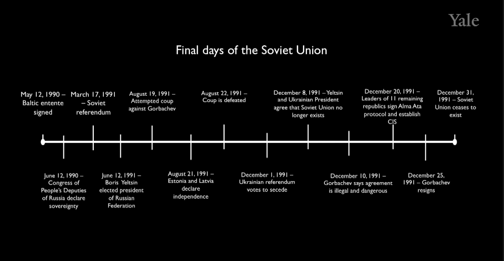

{
  "title": "Power and Politics in Today’s World",
  "date": "2022-09-10T09:07:23Z",
  "lastmod": "2022-09-10T09:07:23Z"
}

# Lecture 2

**Aug 19, 1991 Moskow**: [Coup d'etat against Mikhail Gorbichov](https://en.wikipedia.org/wiki/1991_Soviet_coup_d%27%C3%A9tat_attempt) (came power in Feb 1985)

When came to power in 1985, west thought what would become of Soviet Union?

Gorbachev was younger, talked like a western politician, allowed criticism of the regime. His policies were more open. It seemed like it was starting to change. In 1989 while revolution in Eastern Europe, Russia didn't intervene; this was opposite to Russia's earlier policies. He was seen as a radical reformer. He was getting push back for his ideas.

So in 1991 hardliners from the same party did a coup d'etat.

Yeltsin (then elected president) declared that the coup d'état was illegal. The military also said that they didn't support the coup.

Boris Yelstin
- Initially supported Gorbachev's reforms. 
- He thought they should have been faster. 
- He resigned from communist party in 1987. This was unprecedented then.
- It's said that he even tried to do a suicide at one point.
- Eventually ran for a member of Russian parliament.
- June 1991, he was elected president of Russian parliament.

Without the support of the military, coup failed. Gorbachev didn't leave the party, and fired the people from the party members involved in the coup. As the aftermath, Yelstin gained more popularity and power moved from Gorbachev to Yeltsin.

Agenda

1. why did ussr collapse
2. why was it peaceful
3. rise of gangster capitalism
4. yelstin to putin
5. why is Russia so corrupt and lessons from it.

## Why did USSR collapse?

- Stores were empty. 
- Government department store (7 story building) was empty.
- People making decisions didn't have much/correct data. 
- Prices were not set using supply and demand.
- System became unsustainable.
- [Containment](https://en.wikipedia.org/wiki/Containment) (policy by  George Kennan, ambassador to Russia) worked.
- 1979: Involved in Afghanistan. Spent 1980s in this war. Failed war was a fiscal drain. 
- Ronald Reagan announced Star Wars. Which increased the cost of the arm race.
    
## Why was the collapse peaceful?

Why did elites gave up the power? 
Comment from audience: Elites found ways to protect themselves from a collapse.

[Albert Hirschman's framework (1970)](https://en.wikipedia.org/wiki/Exit,_Voice,_and_Loyalty)

How do we people response to decline?
1. leave
2. complain and get it changed (voice)
3. try to change it by yourself

Which step to take depends on the cost.

For example, a public company badly run
- Sell the shares
- You might be loyal to the company (get is changed), workers would use voice (cost of exit is high).

Collapse of loyalty from the elites and citizens by 1991.
- Evidence of brazen corruption (by professor's first hand experience)
- Elites didn't believe the ideology of the country

If you are not loyal, and the cost of exit is low, why stay and change the organization?

What reduced the cost of exit?
- Reduced political costs of exit
  - Yeltsin exited the party to become a president
  - Eduard Shevardnadze was a foreign minister of the Soviet Union, became president of Georgia 
- Reduced economic costs of exit

## The rise of oligarchs

Result of the collapse. 

- In 1980s agencies (including KGP) started moving money offshore, to live another day to fight, in case of collapse. In 1991 beurocracy disappeared. Many people found themselves in control of unmanaged, unsupervised bank accounts.
- Theft of state assets.
  - Rem Viakhirev (deputi minister of Oil and Gas) was in charge of Gazprom (state venture controlling gas in Soviet Union)
    - he started giving away large assets to relatives and friends at below market price and pocketed the differences.
- Russia had inherited weak and bankrupt state
  - 1990s fiscal crisis for USSR, massive debts, fiscally strapped. And many people took advantage of it for example by lending money to the government in return for state assets which they got to keep, because government couldn't pay it back.

## Yeltsin to Putin

- Last years of the Soviet Union was a weak state, the party however was strong.

Symptoms of a weak state?
- inability to tax (low capacity to raise revenue, didn't have a capacity to audit oil companies for example)
    - Throughout the 1990s oligargs lobbied NOT to improve capacity to raise oil taxes
    - Putin said he was determined the tax system (he did)
- Haphazard use of power
  - Putin took down Khodorkovsky, (reclaimed the assets)
  - Putin took down Vyakhirev, (reclaimed the assets)

## Why Russia is Corrupt.

1. Path dependence (historian's) story
2. Resource Curse (aka oil curse) (political economist's) story
  - 40% of Russian govenments revenue from oil
  - leads to corruption. 

    If only way to get rich in Russia is to have access to the oil sector, then people who control the access will charge premium to get the access.
    
If oil prices fall, government's revenue also falls.
    
### Why don't they diversify?
- Beneficiaries like it this way. 
- Government needs it: weak state
- A source of geopolitical power (e.g. germany was a top importer from Russia)

