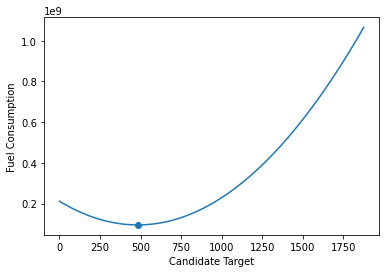

+++
title = "Why the solution to part 2(AoC21-Day7) works?"
date = "2021-12-07T16:28:35+05:30"
author = ""
cover = ""
tags = ["aoc", "optimization"]
keywords = ["", ""]
description = "Day 7(part2) of this year's content brought an interesting problem. Many peoples' solution just worked, but many (including me) had no idea why it worked. This is my attempt to solve that mystery."
showFullContent = false
+++

## Problem

We are given an array of integers, $x_1, x_2, \dots, x_N.$ We want to find an $x$ (also an integer) that minimizes some cost function. 

$$
    argmin_x \sum_{i=1}^N f(x_i, x)
$$

Part 1 has a simple cost function, L1 distance. i.e. $f(x_i, x) = | x_i - x|$. Even with non-differentiability, there is a closed form solution to this function, a median. The proofs are there on the Internet, or the book Probability and Computing[1].

Part 2 has a non-trivial cost function. If L1 between $x_i$ and $x$ is $d$, the cost function $f$ is defined as $f(x_i, x) = \sum_{i=1}^d i = \frac{d(d+1)}{2} \propto d^2+d.$ This cost function is deceptively similar to L2 (or L1)! 

**Note:** The code snippets and values in this blog are from input generated for me. I think Advent of Code generates different inputs for different people. So, you might not be able to replicate exact numbers here, but direction should be same.

## First approach to the solution.

At first, I thought, this is some kind of combination of L1 and L2. Both L1 and L2 cost functions have a closed form solution (median and mean, respectively). Surely, this one has one too. After all, we are at day 7 only! I pulled pen and paper out, and started differentiating.

$$
\begin{aligned}
L(X, x) &= \sum_{i=1}^N f(x_i, x) \\\\
&= \sum_{i=1}^N (x_i - x)^2 + |x_i - x| \\\\
&= \sum_{i=1}^N (x_i^2 + x^2 - 2x_ix) + | x_i - x| \\\\
\end{aligned}
$$

$$
\begin{aligned}
\frac{d L(X, x)}{dx} &= \sum_{i=1}^N (2x - 2x_i) + sign(| x_i - x|) \\\\
&= 2Nx - 2\sum_{i=1}^N x_i + \sum_{i=1}^N sign(| x_i - x|)
 = 0\end{aligned}
$$

I got stuck here. How do I write above thing in the form $x = $ something? 

## Second approach

After banging my head for some time, I changed the approach. It is obvious that the loss function is convex. It is a sum of quadratics and linear terms, each of them is convex. Sum of convex functions is convex. So a unique global minimum exists. But how do I find it in a closed form? Not all convex problems have closed form solutions, e.g. Logistic Regression. 

Also, the solution $x$ has to lie between min(x) and max(x). Obviously! Maybe I can find answer visually?


```python
def cost(X, x):
    d = np.abs(X-x)
    return d*(d+1)/2

s = np.linspace(X.min(), X.max(), 10000)
costs = [cost(X, x).sum() for x in s]
argmin = np.argmin(costs)
```

Following is the output plotted.



`s[argmin]` gave me `482.555`. Since required answer is integer and function is convex, I computed the cost of 482 and 483, and `cost(X, 482) < cost(X, 483)`. And, that indeed, was the correct answer.

## Ok, so what?

Nothing exceptional has happened so far. I could have just used binary search, or could have called heavy guns like PyTorch or JAX to do the optimization.

The thing that surprised me was the statement `print(X.mean())`. This printed `482.59`. The mean is very close to the answer I got using Grid Search! How can I be sure if the mean is not the optimizer? But how can that be? Mean is the optimizer of the L2 loss function. Is this just a coincidence? Many people indeed came up with the solution by just computing the mean instead of doing a grid search. And it works!

To explain why this would work, let's revisit the derivation. This time I will write it differently, so that I don't need to worry about undefined differentiation at some points.


$$
\begin{aligned}
L(X, x) &=
\sum_{i \\; | \\; x_i  \\, \le \\, x} f(x_i, x) +  
\sum_{i \\; | \\; x_i  \\,> \\,x} f(x_i, x) \\\\
&= \sum_{i \\; | \\; x_i  \\, \le \\, x} (x_i - x)^2 + x-x_i +
\sum_{i \\; | \\; x_i  \\,> \\,x} (x_i - x)^2 + x_i - x \\\\
&= \sum_{i=1}^N (x_i^2 + x^2 - 2x_ix) + 
\sum_{i \\; | \\; x_i  \\, \le \\, x} x-x_i +
\sum_{i \\; | \\; x_i  \\,> \\,x} x_i - x \\\\
\end{aligned}
$$

Now, this function is differentiable at all points. 

$$
\begin{align*}
\frac{d L(X, x)}{dx} &= \sum_{i=1}^N (2x - 2x_i) + 
\sum_{i \\; | \\; x_i  \\, \le \\, x} 1 +
\sum_{i \\; | \\; x_i  \\, > \\, x} -1 \\\\
&= 2Nx - 2\sum_{i=1}^N x_i + N_{\le} - N_{>} = 0
\end{align*}
$$

Here, I have defined $N_{\le}$ to be the number of elements less than or equal to $x$, and similarly $N_>$

$$
\begin{align*}
x &= \frac{2\sum_{i=1}^N x_i + N_> - N_\le}{2N} \\\\
  &= \bar{x} + \frac{1}{2} \frac{N_> - N_\le}{N}
\end{align*}
$$

We do not know the values of $N_>$ and  $N_\le$. But, we can get bounds by doing worse case analysis.

In one case, $N_> = 0, N_\le = N$, which gives us $x \ge \bar{x} - \frac{1}{2}$. On other extreme, $N_> = N, N_\le = 0$, which gives us $x \le \bar{x} + \frac{1}{2}$.

So, $\bar{x} - \frac{1}{2} \le x \le \bar{x} + \frac{1}{2}$. This is the reason why looking at integers near to $\bar{x}$ as candidate solutions, was the correct thing to do. 

## References
1. Mitzenmacher, Michael, and Eli Upfal. Probability and computing: Randomization and probabilistic techniques in algorithms and data analysis. Cambridge university press, 2017. (Chapter 3)