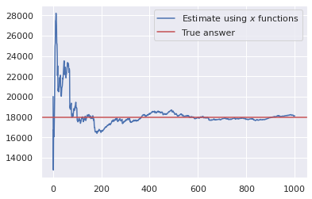

+++
title = "How to find number of unique elements in a stream?"
date = "2021-03-29T14:36:16+05:30"
author = "Dhruv Patel"
cover = ""
tags = ["python", "big data"]
keywords = ["streaming algorithms", "randomized algorithms", "big data"]
description = ""
showFullContent = false
+++

So, I've been reading about streaming algorithms. Seems like the journey to streaming algorithms(aka Algorithms for Big Data) starts with Flajolet-Martin algorithm. 

## The Problem
We are given a sequence `<u_0, u_1, u_2, u_3, ... , u_n>` of `n` elements. Each `u_i` comes from the fixed set `U` of some finite size. We want to see how many elements are unique. 

A simple Python code like below can solve the problem, if we have required memory.

```python
def card(seq):
    return len(set(seq))
```

But we might not have a required memory. Hence we need to make a tradeoff. Use little memory and get an approximate answer or use `O(|U|)` memory, and get the accurate answer. We will go with small memory.

## Flajolet-Martin Algorithm (a handwavy explanation)

The idea behind FM algorithm is that, each element generates an event. Same element has same event associated with it. So if `x_2 == x` generates `blahblah`, and `x_100 == x`, `blahblah` will be generated. Summary is that, you look for an event that is rare. Now if the events are generated from uniform distribution, as we see more and more "rare" events, we can be confident that we have seen "more" unique elements. 

Let me give an example. Say our event is number of trailing zeros of the hash of incoming element. So if hash is `101010`, the trail length is 1. On average how many different hashes would you have to see to see a trail length of 1? It's a coin toss, on average you would have to toss a coin twice to get Heads. What if we wanted 5 heads and 1 tail? You would have to toss a coin 64 times to see that event.

 Wikipedia, Chapter-4 of Mining Massive Datasets, an original paper, and numerous other blogs describe this algorithm, so I won't. I tried to implement this algorithm using trail length as an event, but even with using 1000 hash functions I wasn't able to get reasonably close answer. So I will describe and implement, what I believe is a better version of the same algorithm.

Instead of trailing length, let our event generator be a function `f: U -> [0, 1]`. If function was chosen randomly from a family of eligible functions, we could expect that for any fixed stream, `<f(x_1), f(x_2), ...>` would be uniformly random between 0 and 1. Now our definition of "rarity" is the smallest of `f(x_i)`s. In a stream of 1000 elements, the smallest element you saw was 0.7?, I don't think there are that many elements. Even if there were 2 unique elements, we should have seen number `< 0.5` with 0.75 probability. On the other hand, in a stream of 1000 elements, the smallest element you saw was 0.01?, looks like there are many unique elements.

What exactly is many? Well as per this algorithm, on average, if smallest number was `s`, there were `1/s - 1` unique elements in the stream. To answer why exactly this number, you might want to read [these lecture notes.](https://www.sketchingbigdata.org/fall20/lec/notes.pdf) Now this is not an exact answer, but with high probability it is close to the correct answer. If we want to be more certain, compute the number using different randomly picked function then compute the average. Using Law of Large numbers, as more and more experiments we do, the average gets closer and closer to the correct answer.

## Implementation

### Ingredients

1. A stream, (you know, to test the implementation.)
2. Around say thousand, randomly picked functions of the form `U -> [0, 1]`

For the stream, I will use [Leo Tolstoy's War and Peace](https://en.wikipedia.org/wiki/War_and_Peace). You can download one from [Project Gutenberg](https://www.gutenberg.org/files/2600/2600-0.txt). I will use [spaCy](https://spacy.io/) to preprocess the text.

```python
from spacy.lang.en import English

with open('./data/war_and_peace.txt') as f:
    data = f.read()
nlp = English(max_length=len(data))
doc = nlp(data)

stream = [token.lower_ for token in doc 
          if not (token.is_punct or token.is_space)]

print(' '.join(stream[1000:1010]))
```

```text
speaker was the well known anna pávlovna schérer maid of
```

To pick a function, first I generate 64 random bits, and then xor them with `hash(token)` which is also 64 bit long on modern machines. First I will write a function that can generate many such "functions" in a batch. 

```python
import random

def initialise_hash_fn(n, seed=42):
    masks = []
    for i in range(n):
        random.seed(seed+i)
        masks.append(random.getrandbits(64))
    return masks

masks = initialise_hash_fn(1000)
```

But xor gives me a number between 0 and 2^64-1, I need between 0 and 1. So will have to divide the resultant hash by 2^64-1.

Finally, I process the stream. I've thousand masks for thousand random functions.

```python 
def get_estimates(masks, stream):
    masks = np.array(masks, dtype=np.uint64)
    stream = np.array([hash(t) for t in stream], dtype=np.uint64)
    mx = np.iinfo(np.uint64).max
    mn = np.ones(len(masks))

    for element in stream:
        s = (masks ^ element)/mx
        mn = np.where(mn < s, mn, s)
    return mn

estimates_raw = get_estimates(masks, stream)
estimate_raw = np.mean(estimates_raw)
print(1/estimate_raw - 1, len(set(stream)))
# prints, 18117.553711596098 17982
```

So actual answer is 17,982 and estimated answer is 18,117. Error of around 150, not bad!

We can also see the effect of using more and more random functions below.

```python
cumsum = estimates_raw.cumsum()
z = np.arange(len(cumsum)) + 1

estimates = cumsum/z
estimates = 1/estimates - 1

plt.plot(z, estimates)
plt.axhline(true_n_uniq, c='r')
```




[^1]: [Original Paper](http://algo.inria.fr/flajolet/Publications/FlMa85.pdf)