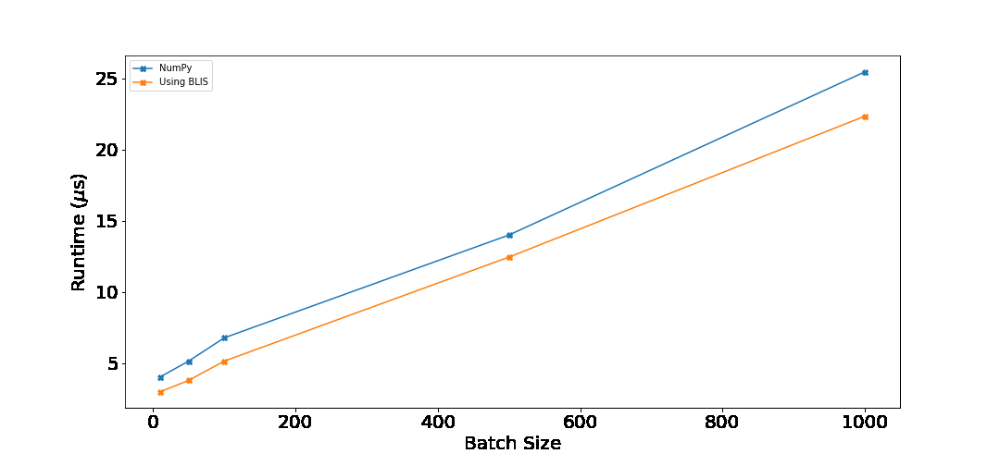

+++
title = "Can we do better than NumPy in special cases?"
date = "2022-04-10T09:11:23+05:30"
cover = ""
tags = ["python", "hpc", "blas"]
keywords = ["numpy", "python", "blas", "blis", "openblas"]
description = "Can we do better than NumPy by trading generality? Answer is yes, by using BLAS and C extension."
showFullContent = false
draft = true
+++

## Can we?
Yes. This blog explains how I did. If you want to follow the whole code, you can download the source code from [GitHub repository.](https://github.com/DhruvPatel01/notebooks/tree/main/High_Performance_Computing/mat_vec)

## Why would we?

Good question. NumPy is great. It is fast. Beating it would be hard. Even if we beat it, will it be worth it? Probably not. You would quote Donald Knuth and say that premature optimization is the root of all evil. I am trying to justify this blog by asking What if this is not a premature optimization? I would have tried other optimizations, and now I would want to see if I can squeeze out anything else.

To quote Pavlo Andy, when money is involved, constants matter. Even if I can outperform NumPy by a measly 10%, it could be worth it at scale.

I will be focusing on a problem of matrix vector multiplication. This is not a toy problem. Many machine learning algorithms ultimately just boil down to computing cosine distance between candidate vectors with anchor vector, at least during inference. You can replace cosine with dot, if you store normalized vectors into your datastore. I will also assume that the number of rows in my matrix is <1000. This is also a reasonable assumption. We might not want to wait to batch user requests if we don't want to sacrifice latencies.

## How could we?

So, here is what I am thinking. `np.dot` works, but it is general. It might need to check for continuity, data layout, etc. In production setting, I might know these variables a priory. What if I just skip these checks? Furthermore, I don't know what happens under the hood in NumPy. Sure, `np.show_config()` can tell me if NumPy was compiled with `BLAS` or not. But, does it use all the optimizations available when I actually make a call to `np.dot`?

I did try Numba. But, this is just a dot product. Nothing much complicated. Numba's performance was no good than NumPy. 

Similarly, just lowering the computation to C is not going to beat it. Surely, NumPy does the same thing, but in a more sophisticated manner. I will have to use some `BLAS` implementation. I will report my numbers using `BLIS`[^1], though I have also tried OpenBLAS[^2], and the numbers were similar.  I am picking BLIS over OpenBLAS, as I have some experience of using it in the course [Programming for high performance](https://www.cs.utexas.edu/users/flame/laff/pfhp/) from the authors of BLIS, and I think for this simple matrix vector computation, both should be equally optimized. I am not using MKL as I am using AMD processor, and I have read reports that MKL does not perform well on AMD.

My NumPy installation showed OpenBLAS in `np.show_config()`. So this is a fair comparison.

### Step 1: Installing BLIS(or OpenBLAS, or something else).

```bash
git clone https://github.com/flame/blis.git

cd blis
./configure -t openmp -p ~/blis auto    
make -j8
make check -j8
make install
```

This will install the header files and static library respectively into `~/blis/include/blis` and `~/blis/lib/libblis.a`. I will use these when I compile a wrapper around a BLAS `dgemv` call. `dgemv` stands for Generalized Matrix Vector multiplication. `d` prefix means that inputs are double precision floating points. For FP32 you would use `sgemv`.



git clone https://github.com/xianyi/OpenBLAS.git
cd OpenBLAS

make PREFIX=/home/dhruv/OpenBLAS
make PREFIX=/home/dhruv/OpenBLAS install



### Step 2: Write and compile a wrapper around BLAS.

As you might have noticed, BLAS routines are also general (hence the g in gemv). The `bli_dgemv`[^3] computes $y := \beta y + \alpha * trans(A)* conjugate(x)$. Yup, we could conjugate a vector even if we are working with real numbers! I am not sure how it works here, I am not going to use transpose and conjugate features anyway. In my case, $\beta = 0, \alpha=1$.

The general signature of `bli_dgemv` is 

```c
void bli_dgemv
     (
       trans_t transa,
       conj_t  conjx,
       dim_t   m,
       dim_t   n,
       double*  alpha,
       double*  a, inc_t rsa, inc_t csa,
       double*  x, inc_t incx,
       double*  beta,
       double*  y, inc_t incy
     );
```

* `transa` tells blis if we want to transpose A before the multiplication. I don't, so I will use `BLIS_NO_TRANSPOSE`.
* `conjx` tells blis if we want to conjugate x. I don't, so I will use `BLIS_NO_CONJUGATE`.
* m is the number of rows of A.
* n is the number of columns of A.
* $\alpha, \beta$ were explained earlier.
* `double *a`, is a pointer to the matrix A. I will have stored the matrix in row major order, so `rsa`(row stride) will be `n` and `csa`(column stride) will be 1.
* `x` is a pointer to array where x, the vector we want to multiply A with, stays.
* `y` is a pointer to array where Ax will be saved.
* `incx` and `incy` will be 1 as I know I have continuous arrays `x` and `y`.


#include "blis.h"

void blis_gemv_raw(int m, int n, double *c_matrix, double *x, double *y)
{
    double one = 1.0;
    double zero = 0.0;
    bli_dgemv(BLIS_NO_TRANSPOSE, BLIS_NO_CONJUGATE, 
              m, n, &one, c_matrix, n, 1, 
              x, 1, 
              &zero, 
              y, 1);
}


To compile `gemv_blis.c` into `gemv_blis.o`, I used the following command, adapted from the PfHP course I mentioned earlier.

```bash
gcc -c -O3 -m64 -mavx2 -std=c99 -march=native \
-fopenmp -D_POSIX_C_SOURCE=200809L -I/home/dhruv/blis/include/blis \
gemv_blis.c
```

Note that though I am using `-fopenmp`, I will not use multithreading, as multithreading is not much useful when we work with small data (as mentioned in the introduction.) For this, I will set `OMP_NUM_THREADS=1`. 

The installed NumPy also had detected `AVX2` support. So I will be doing a fair comparison. For those who do not know AVX2 or SIMD, SIMD stands for single instruction multiple data. SIMD is the reason why naive lowering to C would not have worked. When used properly, AVX2 instruction can execute floating points operations on 256 bits at a time. We can pack four fp64 numbers in 256 bits, so this would theoretically increase our performance by 4x. BLIS leverages AVX2. 

I am not writing the details for OpenBLAS wrapper and process of compiling it. If you are interested, please see `Makefile` and `gemv_openblas.c` files in the GitHub repository accompanying this post[^4].


### Step 3: Writing the C extension.

We will need to call this wrapper function from Python. We can't do that directly, as the wrapper expects pointers to raw memory. One alternative is to use `ctypes`. I did try that, and converting NumPy arrays to appropriate pointers itself was taking more than the whole `np.dot`. Instead, I am opting for writing a C extension to Python. I won't be explaining the boilerplate code, please visit [this link](https://docs.python.org/3/extending/extending.html) which explains the process. 


```c {linenos=true,hl_lines=[3]}

...
void blis_gemv_raw(int m, int n, double *c_matrix, double *x, double *y);
...

static PyObject *
blis_dgemv(PyObject *self, PyObject *args)
{
    const void  *a;
    Py_ssize_t asize;
    Py_buffer in_buf, out_buf;
    in_buf.buf = out_buf.buf = NULL;
    in_buf.len = out_buf.len = 0;

    if (!PyArg_ParseTuple(args, "s#s*s*", &a, &asize, &in_buf, &out_buf)) {
        if (in_buf.buf) PyBuffer_Release(&in_buf);
        if (out_buf.buf) PyBuffer_Release(&out_buf);
        return NULL;
    }

    int m, n;
    m = out_buf.len/sizeof(double);
    n = in_buf.len/sizeof(double);
    
    blis_gemv_raw(m, n, a, in_buf.buf, out_buf.buf);
    
	Py_RETURN_NONE;
}
```

In line 3, I declare the signature for `blis_gemv_raw` defined and now residing in `gemv_blis.o`. Next, I define a new function called `blis_gemv`. This function will be called from Python with three arguments, namely matrix A, vector x, and vector y. I'm calling x as in_buf and y as out_buf. Once this parsing is successful, I compute m and n. m is computed using y and n is computed using x. Once I have all the arguments, I just call the wrapper around `bli_dgemv`. 

### Step 4: Compiling the C extension.

Finally, we need to create a shared object file that can be imported from Python. This is easy. Following is the `setup.py` file.

```python
from setuptools import setup, Extension

module1 = Extension('gemv',
                    sources=['gemvmodule.c'],
                    extra_objects=['gemv_blis.o', 
                                   '/home/dhruv/blis/lib/libblis.a'],
                    libraries=['m', 'pthread'],
                    extra_compile_args=['-fopenmp'],
                    extra_link_args=['-fopenmp', '-m64'])

setup(name='gemv', version='0.1', ext_modules=[module1])

```
Generate the `gemv.so` (or something similar, depending upon your OS), using the following command.
```bash
python setup.py build_ext --inplace
```

Et, voila! Now we can just `import gemv` and call the `gemv.blis_dgemv` with three appropriately shaped ndarrays.

## Benchmarking

I ran both NumPy and BLIS based implementation on batches of [10, 50, 100, 500, 1000] for vector size of 128. Following are the results.



Following table shows percentage improvement over `np.dot`. This was computed as $\frac{\text{numpy_time} - \text{numpy_time}}{\text{numpy_time}}$.

| batch_size | %improvement |
|------------|--------------:|
| 10 | 25.75 % |
| 50 | 26.21 % |
| 100 | 24.07 % |
| 500 | 11.06 % |
| 1000 | 12.22 % |


## Conclusion
For all the batch sizes, our implementation performs better than NumPy. When the batch size is ≤ 100, the improvements are around 25%. As the batch size increases, the percentage improvement decreases. This is expected, as more time would be taken by the computation instead of the overhead. Still, 10% is good! You can run the benchmark on your computer by running `benchmark.py` from the GitHub repository.

However, call me greedy if you want, but maybe there is still a scope for improvement? gemv is a general implementation. Maybe just for the pure dot product, we can strip some code out? Worth experimenting. I'll write a new blog if I do that. Meanwhile, if you have any suggestions, or comments, please drop me an email at `hello@dxxxxxxxxl.dev`.

## References
[^1]: [https://github.com/flame/blis/](https://github.com/flame/blis/)

[^2]: [https://www.openblas.net/](https://www.openblas.net/)

[^3]: [https://github.com/flame/blis/blob/master/docs/BLISTypedAPI.md#gemv](https://github.com/flame/blis/blob/master/docs/BLISTypedAPI.md#gemv)

[^4]: [https://github.com/DhruvPatel01/notebooks/tree/main/High_Performance_Computing/mat_vec](https://github.com/DhruvPatel01/notebooks/tree/main/High_Performance_Computing/mat_vec)